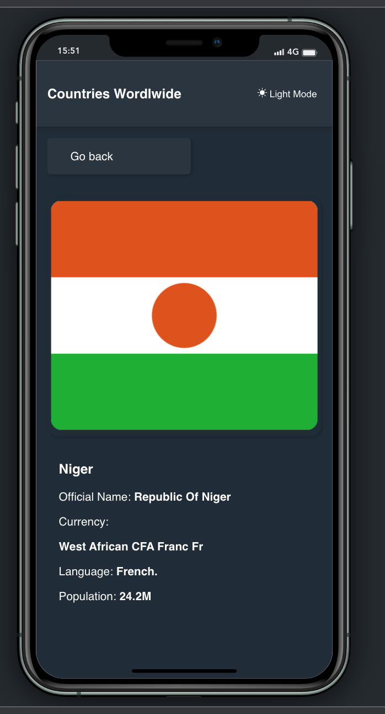
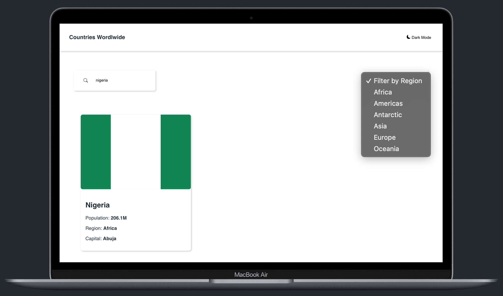
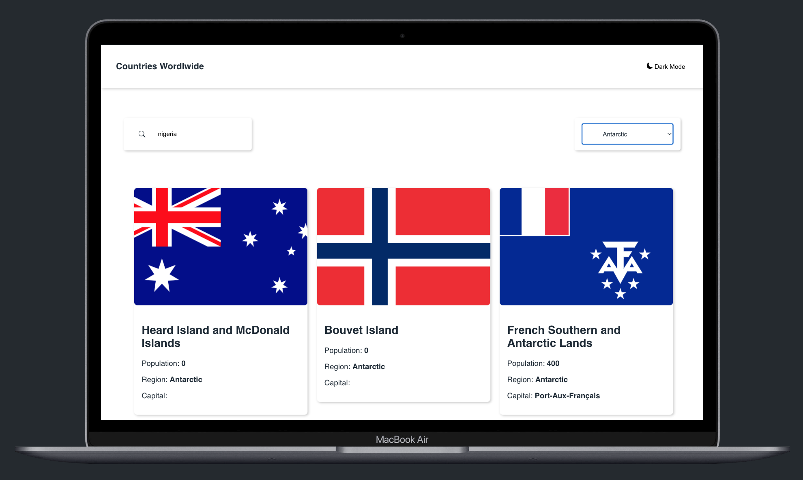
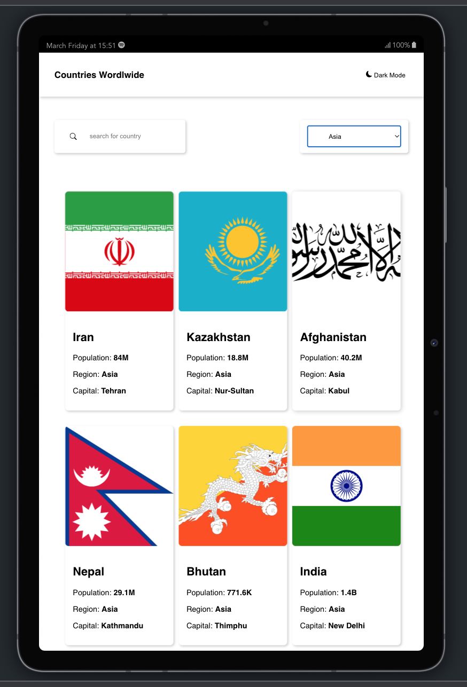
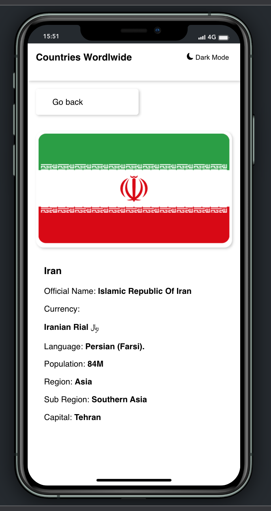

# Country Search App

This project was bootstrapped with [Create React App](https://github.com/facebook/create-react-app).

## Live links

[errytagecountries.netlify.app](https://errytagecountries.netlify.app/).

## App Description

This is a React web app that allows you to search for countries and filter them by region. You can also view more details about each country by clicking on its name.

## Technologies Used

1. ReactJs.
2. [Bootstrap](https://getbootstrap.com).
3. [REST Countries API](https://restcountries.com/)
4. [Axios](https://axios-http.com/docs/intro)
5. [Custom-Hook](https://reactjs.org/docs/hooks-custom.html)

## Features

1. Search: You can search for countries by name or partial name. The app will display a list of matching countries, along with their flags, names, and population.

2. Filtering: You can filter the list of countries by region (Africa, Americas, Asia, Europe, Oceania).

3. Read More Page: You can view more details about each country by clicking on its name. The app will display a separate page with information about the country's capital, population, currency, and languages.

4. Dark and Light Mode theme

## Preview

## Installation

To run the app locally, follow these steps:

Clone the repository: git clone https://github.com/your-username/country-search-app.git
Install the dependencies: npm install
Start the app: npm start

## Contributing

If you find any bugs or issues with the app, feel free to open a new issue on the GitHub repository. If you would like to contribute to the project, you can fork the repository and submit a pull request with your changes.
